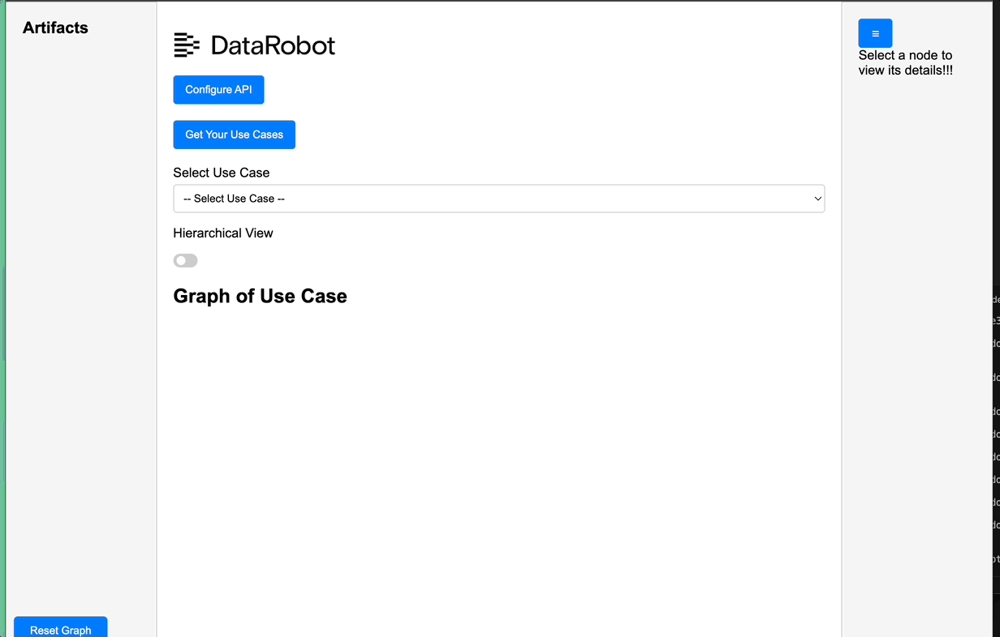

## DataRobot Lineage Viewer

This application allows you to view dependency graphs for DataRobot Use Cases.  


## Build
```
docker build --platform="linux/amd64" -t lineage-app .
docker run --publish 8080:8080 lineage-app   
```
## Use
Tbe go to localhost:8080/apps to view the app.  You'll need to provide your api token and endpoint to retrieve and view your use cases.  
