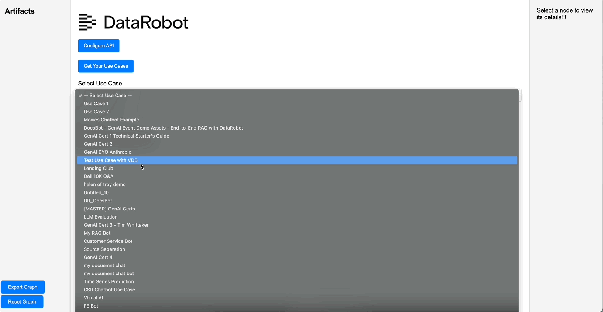

## DataRobot Lineage Viewer

This application allows you to view dependency graphs for DataRobot Use Cases.  It is Use case-centric, so all assets for a use case are retrieved, and from there we fill in all asset parents.  



## Build and Run
```
docker build --platform="linux/amd64" -t lineage-app .
docker run --publish 8080:8080 lineage-app   
```
## Use
Tbe go to localhost:8080/apps to view the app.  You'll need to provide your api token and endpoint to retrieve and view your use cases.  

## Push to DataRobot 

Once you've built the image, save it 
```
docker save -o lineage_app.tar lineage-app
```
Now use [`drapps`](https://github.com/datarobot/dr-apps)
```
drapps create -i lineage-app.tar "DataRobot Lineage App 20250206"
```

